# LineBot
Line follower is an autonomous robot, that tracks the black line. Robot works thanks to the line sensor (qtr8 from pololu). The sensors detects diffrence between colors. This projects combines automatics, micrcontroller programming and 3d printing.

### Table of contents 
- [Introduction](#introduction)
- [PD Algorithm](#pid-algorithm)
- [Installation](#installation)
- [Assembly](#assembly)
- [License](#license)

## Introduction
Stable and fast line follower is a great robot that helps us understand the role of the theory contorl in modern autonomous vehicles. The same algorithm can be implemented in camera based line follower or cars that drive between the lines. Knowledge gained by completing this project will help to create more advanced driving systems in the future.

## PD Algorithm 
This project implements PD regulator in velocity form, it is widely used in mobile robots. We have implemented the discrete form of the PD reulator's equation. 

- *P* - the propotional term, it produces a correction propotional to how big error is. This term pushes robot toward the line and acts as the main steering force. Strongly reacts to bigger errors, sometimes the result is overshooting.

- *D* - the derivative term, it tells how quickly the error is changing. It reacts to the speed of movement away from or toward the line. Tuning this parameter helps us to reduce oscillation and smooths turns. Overally slows down the robot to avoid overshooting.

The general equation form:
```math
u(t) = K_P e(t) + K_D\frac{d e(t)}{dt}
```

The discrete equation form:

```math
u(t) = K_P e(t) + K_D(e(t) - e(t-1))
```

- $u(t)$ - current velocity, in other words duty cycle of the motors.
- $K_P$ - propotional term, tells how strong react to turns.
- $K_D$ - derivative term, reduces overshooting.
- $e(t)$ - error at the time t, the difference between robot and line positions.

## Installation 
1. Download <a href="https://www.arduino.cc/en/software/">Arduino IDE</a> and install QTRSensors library.
2. Clone github repository to your computer:
  ```
  https://github.com/SKN-SEP/LineBot.git
  ```
3. Connect your arduino to computer and upload the program.

## Assembly 
In order to build this robot, you need all the parts listed in the table below. The corresponding STL models are in the models folder. The skills required to assemble this robot include 3D printing, soldering, and cable management.
| Name                 | Description                                                                 | Image                                   |
|----------------------|-----------------------------------------------------------------------------|-----------------------------------------|
| Arduino Uno          | Microcontroller board for controlling sensors and motors                    | 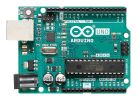 |
| Cables 15 cm         | Short cables for connecting sensors, motors, power, and controller          | 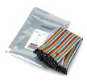     |
| QTR‑8 Pololu         | IR reflectance sensor array (for line tracking / floor detection)           | 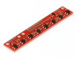      |
| DC Motor 1           | One of the two DC motors — drives wheel / movement                         |      |
| DC Motor 2           | Second DC motor — drives wheel / movement                                  | 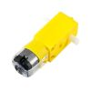     |
| Chassis (AliExpress) | The base frame / body of the robot where motors, electronics, and wheels mount | 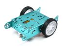       |
| Li‑ion Batteries ×3  | Three Li‑ion batteries — main power supply for motors / controller          | 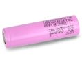 |
| Battery Slot (for 3) | Battery holder/slot for the 3 Li‑ion batteries                             | 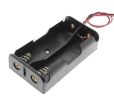 |
| DC Switch            | Power switch controlling overall power on/off for the robot                | 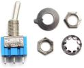     |
| L298N Motor Driver   | Dual H‑bridge driver to control the two DC motors (direction & speed)       | 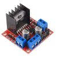      |
| Ultrasonic Sensor    | Detection sensor, used to check if there are obstacles on the way       | 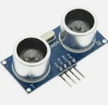      |
| Filament (for 3D printing) | Thermoplastic filament used if you 3D‑print custom parts (e.g. mounts, holders, covers) | 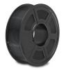 |

## License
This project is licensed under the MIT License. See the LICENSE file for details.
